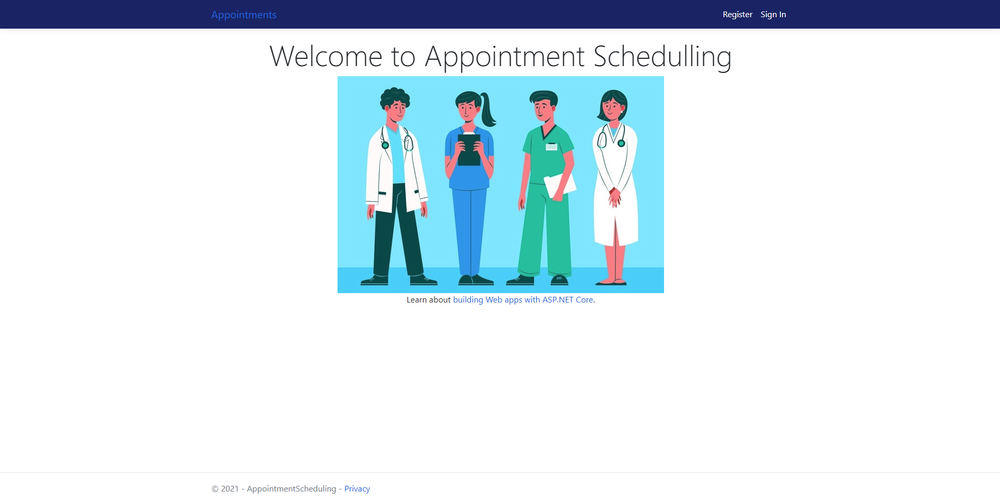

# Appointment Scheduling

## intro 
this project is build in c# .net framework  
the project consists of an appointment scheduling agenda where each user has their own agenda and can check the times

## back - end 
the project was done using the concept of MVC, and dependency injection.
Furthermore, the focus was to train the integration of C# with services outside the application.
 
the S.O.L.I.D concepts were also used to better read the code, in addition to microsoft's own standards.

## Develop ambient
first you have to configure the `appsettings.json` where the `DefaultConnection` has to be set with the configurations of you database.
 

If you need you can use `myCustomConnString` for the eliminate any error.
 

after this you have to build the migrations and update the database.
1. `dotnet ef migrations add "message"`
2. `dotnet ef database update`
 

to finished you net to compile the project, in the terminal you can run
1. `dotnet build`
2. `dotnet run`

##  this version of the project is dotnetCore 5.0
 

# Visual

 
This is a home page of application, built with bootstrap and javascript.
 
 

### project based on the course of the instructor Denis Polijuta
 (https://www.udemy.com/user/denispanjuta/)
 

### more courses  (https://www.dotnetmastery.com/#course)